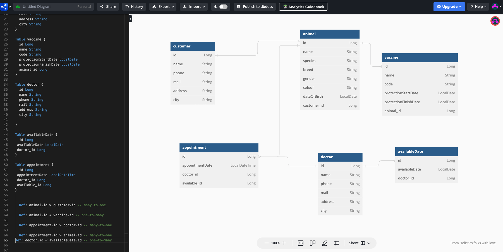
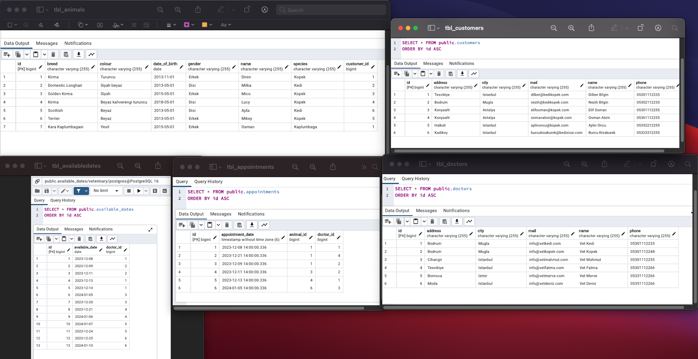

# Veteriner Yönetim Sistemi

Veteriner Yönetim Sistemi, hayvan sahipleri, hayvanlar, doktorlar, doktorlarin musait gunleri,
randevular ve aşılar gibiveterinerlikle ilgili temel kayıtları yönetmek için geliştirilmiş
bir REST API projesidir.
Bu uygulama veteriner calisani tarafindan kullanilacaktir.

## Teknolojiler

- Java 17
- Spring Boot
- Spring Web
- Spring Data JPA
- PostgreSQL
- Lombok
- Mapstruck
- Postman
- Swagger

## Proje Yapısı

Proje aşağıdaki bileşenleri içermektedir:

- **ENTITY**
- **REPOSITORY**
- **DTO** / REQUEST-RESPONSE
- **MAPPER**
- **SERVICE**
- **CONTROLLER**

## Uygulama Başlatma

Proje Spring Boot ile geliştirildiği için, uygulamayı ayağa kaldırmak için aşağıdaki adımları izleyebilirsiniz:

1. Proje kaynak kodlarını bilgisayarınıza indirin.
2. PostgreSQL veritabanınızı oluşturun ve bağlantı bilgilerini `application.properties` dosyasında güncelleyin.
3. Projeyi bir IDE'de (IntelliJ IDEA, Eclipse vb.) açın.
4. `VeterinaryApp` sınıfını bulun ve çalıştırın.

Uygulama başlatıldığında, [http://localhost:8080](http://localhost:8080) adresinden API'ye erişebilirsiniz.

## Endpoints

Aşağıda, API'nin sunduğu temel endpoint'lerin bir listesi bulunmaktadır:

| Endpoint                                     | HTTP Metodu | Açıklama                                                                |
|----------------------------------------------|:------------|-------------------------------------------------------------------------|
| `/api/v1/vaccines/{id}`                      | GET         | Belirtilen ID'ye sahip asiyi getir                                      |
| `/api/v1/vaccines/{id}`                      | PUT         | Belirtilen ID'ye sahip asiyi guncelle                                   |
| `/api/v1/vaccines/{id}`                      | DELETE      | Belirtilen ID'ye sahip asiyi sil                                        |
| `/api/v1/vaccines`                           | GET         | Tum asilari getir                                                       |
| `/api/v1/vaccines`                           | POST        | Asi ekle                                                                |
| `/api/v1/vaccines/finishDate`                | GET         | Girilen tarih araligina gore asi kayitlari                              |
| `/api/v1/vaccines/findByAnimalId/{animalId}` | GET         | Belirli bir hayvana ait tüm aşı kayıtları                               |
|                                              |             |                                                                         |
| `/api/v1/doctors/{id}`                       | GET         | Belirtilen ID'ye sahip doktoru getir                                    |
| `/api/v1/doctors/{id}`                       | PUT         | Belirtilen ID'ye sahip doktoru guncelle                                 |
| `/api/v1/doctors/{id}`                       | DELETE      | Belirtilen ID'ye sahip doktoru sil                                      |
| `/api/v1/doctors`                            | GET         | Tum doktorlari getir                                                    |
| `/api/v1/doctors`                            | POST        | Doktor ekle                                                             |
|                                              |             |                                                                         |
| `/api/v1/customers/{id}`                     | GET         | Belirtilen ID'ye sahip hayvan sahibini getir                            |
| `/api/v1/customers/{id}`                     | PUT         | Belirtilen ID'ye sahip hayvan sahibini guncelle                         |
| `/api/v1/customers/{id}`                     | DELETE      | Belirtilen ID'ye sahip hayvan sahibini sil                              |
| `/api/v1/customers`                          | GET         | Tum hayvan sahiplerini getir                                            |
| `/api/v1/customers`                          | POST        | Hayvan sahibi ekle                                                      |
| `/api/v1/customers/byName`                   | GET         | Isme gore hayvan sahipleri                                              |
|                                              |             |                                                                         |
| `/api/v1/available_dates/{id}`               | GET         | Belirtilen ID'ye sahip musait gunu getir                                |
| `/api/v1/available_dates/{id}`               | PUT         | Belirtilen ID'ye sahip musait gunu guncelle                             |
| `/api/v1/available_dates/{id}`               | DELETE      | Belirtilen ID'ye sahip musait gunu sil                                  |
| `/api/v1/available_dates`                    | GET         | Tum musait gunleri getir                                                |
| `/api/v1/available_dates`                    | POST        | Musait gun ekle                                                         |
|                                              |             |                                                                         |
| `/api/v1/appointments/{id}`                  | GET         | Belirtilen ID'ye sahip randevuyu getir                                  |
| `/api/v1/appointments/{id}`                  | PUT         | Belirtilen ID'ye sahip randevuyu guncelle                               |
| `/api/v1/appointments/{id}`                  | DELETE      | Belirtilen ID'ye sahip randevuyu sil                                    |
| `/api/v1/appointments`                       | GET         | Tum randevulari getir                                                   |
| `/api/v1/appointments`                       | POST        | Randevu ekle                                                            |
| `/api/v1/appointments/doctorId`              | GET         | Kullanıcı tarafından girilen tarih aralığına ve doktora göre randevular |
| `/api/v1/appointments/animalId`              | GET         | Kullanıcı tarafından girilen tarih aralığına ve hayvana göre randevular |
|                                              |             |                                                                         |
| `/api/v1/animals/{id}`                       | GET         | Belirtilen ID'ye sahip hayvani getir                                    |
| `/api/v1/animals/{id}`                       | PUT         | Belirtilen ID'ye sahip hayvani guncelle                                 |
| `/api/v1/animals/{id}`                       | DELETE      | Belirtilen ID'ye sahip hayvani sil                                      |
| `/api/v1/animals`                            | GET         | Tum hayvanlari getir                                                    |
| `/api/v1/animals`                            | POST        | Hayvan ekle                                                             |
| `/api/v1/animals/byName`                     | GET         | Isme gore hayvanlar                                                     |
| `/api/v1/animals/byCustomerName`             | GET         | Hayvan sahiplerine gore hayvanlar                                       |
|                                              |             |                                                                         |

Her endpoint'in detayları için ilgili controller sınıflarını inceleyebilirsiniz.

